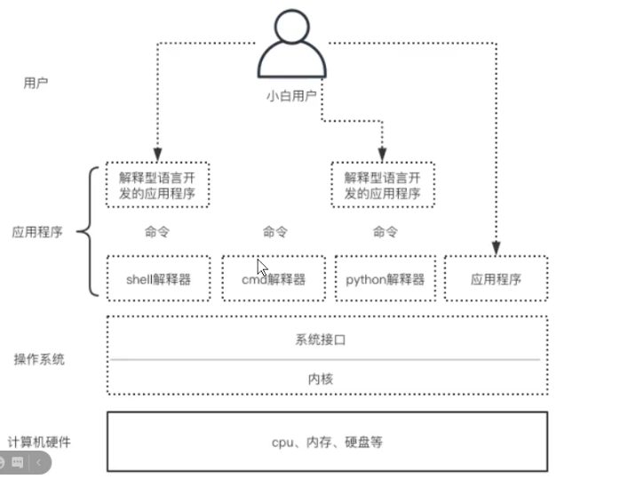
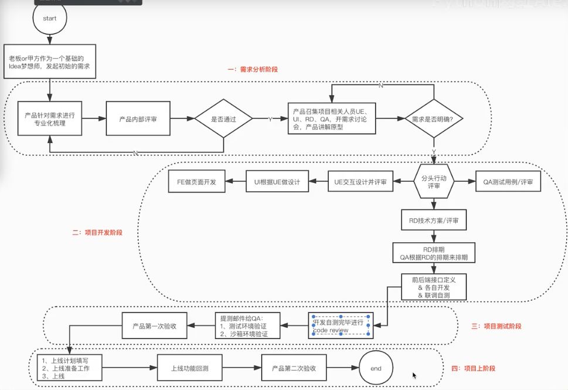

# 计算机原理笔记

## 1.什么是编程,为什么要编程,什么是程序

- 什么是编程

	1. 把计算机做事的步骤想清楚

 	2. 用一种计算机能听懂的语言(编程语言)把事的步骤翻译下来

- 为什么要编程

  为了取代人力

- 什么是程序

  程序就是一堆代码文件

- ps:

  计算机就是一堆废铁,计算机运行全都要受程序控制

  可以说程序就是计算机硬件的灵魂

  硬件意外的都叫软件

- 软件分类

  - 操作系统: 就是一个协调,管理,控制计算机硬件资源与应用软件的一个控制程序
  - 应用软件

- 计算机体系的三成结构

  - 应用程序

  - 操作系统(linux,windows,mac)

  - 硬件

    

    ## 2. 计算机硬件组成原理

    1. 程序开发流程

        - PM产品经理

        - UE交互设计

        - UI设计

        - FE前端开发

        - RD后端开发

        - QA测试人员=> 设计好测试用例

        - OP运维人员 => 设计好整套系统的架构

        

        
程序开发流程图

        
    2. 运维职责
    
        应用程序 7\*24\*365 天的不间断运行 => 监控
    
        数据备份
    
        优化
    
    3. 计算机硬件
    
    

