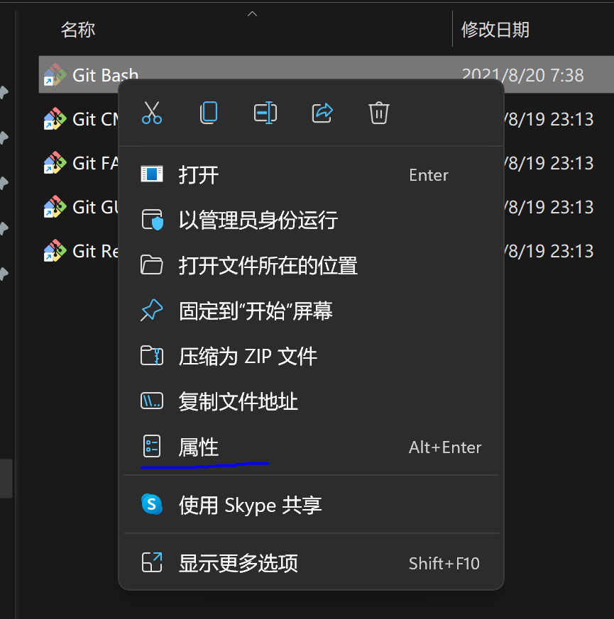
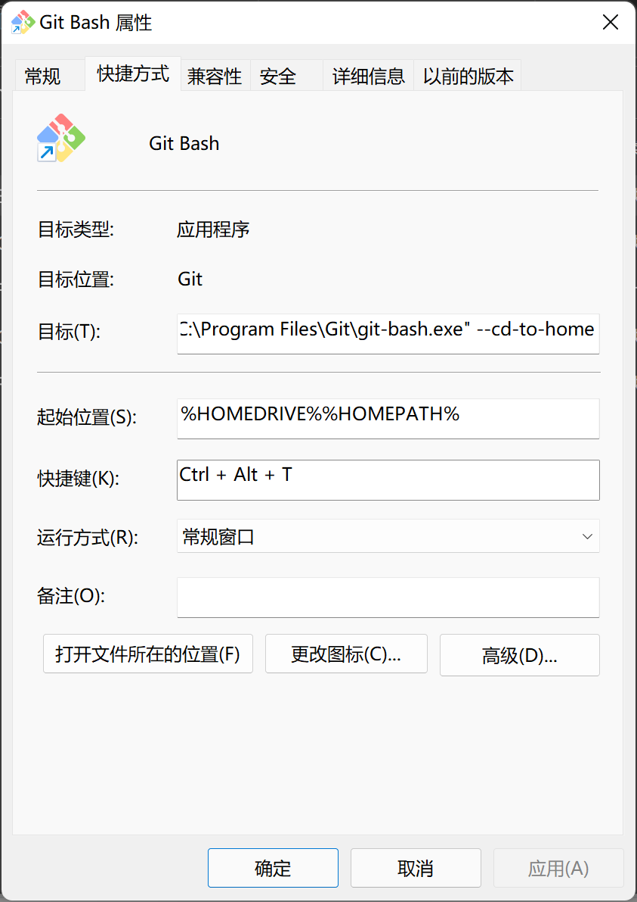
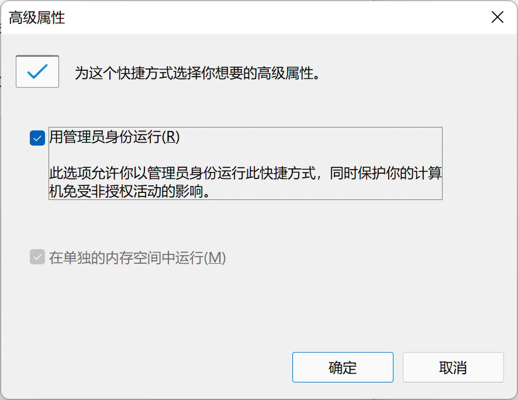

# windows

## [安装 typro](https://typora.io/)

## [安装vscode](https://code.visualstudio.com/Download)

## [git 安装设置](https://git-scm.com/)

- 美化终端

  - [下载字体](https://www.jetbrains.com/lp/mono/) 安装字体
  - 修改git bash 属性

  

  

  

  - 配置主题文件 

  ```shell
  code ~/.minttyrc
  ```

  - 粘贴如下内容

  ```
  Font=Jetbrains Mono
  FontHeight=14
  Transparency=low
  FontSmoothing=full
  Locale=zh_CN
  Charset=UTF-8
  Columns=88
  Rows=26
  OpaqueWhenFocused=no
  Scrollbar=none
  Language=zh_CN
  
  ForegroundColour=255,255,255
  BackgroundColour=0,43,54
  CursorColour=220,130,71
  
  BoldBlack=128,128,128
  Green=64,200,64
  BoldGreen=64,255,64
  Yellow=190,190,0
  BoldYellow=255,255,64
  Blue=135,144,255
  BoldBlue=30,144,255
  Magenta=211,54,130
  BoldMagenta=255,128,255
  Cyan=64,190,190
  BoldCyan=128,255,255
  White=250,240,230
  BoldWhite=250,240,230
  
  BellTaskbar=no
  Term=xterm-256color
  FontWeight=400
  FontIsBold=no
  BellType=0
  
  CtrlShiftShortcuts=yes
  ConfirmExit=no
  AllowBlinking=yes
  BoldAsFont=no
  ```

  - 配置二修改

  ```shell
  code /etc/profile.d/git-prompt.sh
  ```

  - 粘贴如下内容

  ```shell
    if test -f /etc/profile.d/git-sdk.sh
    then
        TITLEPREFIX=SDK-${MSYSTEM#MINGW}
    else
        TITLEPREFIX=$MSYSTEM
    fi
  
    if test -f ~/.config/git/git-prompt.sh
    then
        . ~/.config/git/git-prompt.sh
    else
        PS1='\[\033]0;Bash\007\]'      # 窗口标题
        PS1="$PS1"'\n'                 # 换行
        PS1="$PS1"'\[\033[32;1m\]'     # 高亮绿色
        PS1="$PS1"'➜ '               # unicode 字符，右箭头
        PS1="$PS1"'\[\033[33;1m\]'     # 高亮黄色
        PS1="$PS1"'\W'                 # 当前目录
        if test -z "$WINELOADERNOEXEC"
        then
            GIT_EXEC_PATH="$(git --exec-path 2>/dev/null)"
            COMPLETION_PATH="${GIT_EXEC_PATH%/libexec/git-core}"
            COMPLETION_PATH="${COMPLETION_PATH%/lib/git-core}"
            COMPLETION_PATH="$COMPLETION_PATH/share/git/completion"
            if test -f "$COMPLETION_PATH/git-prompt.sh"
            then
                . "$COMPLETION_PATH/git-completion.bash"
                . "$COMPLETION_PATH/git-prompt.sh"
                PS1="$PS1"'\[\033[31m\]'   # 红色
                PS1="$PS1"'`__git_ps1`'    # git 插件
            fi
        fi
        PS1="$PS1"'\[\033[36m\] '      # 青色
    fi
  
    MSYS2_PS1="$PS1"
  ```

  


- 设置全局用户名和邮箱

```shell
git config --global user.name "xxxx"

git config --global user.email "xxxx"
```


- 关闭 lf 和 crlf

```shell
  git config --global core.autocrlf false
```

## [nodejs 安装](http://nodejs.cn/download/current/)

## npm 设置

- 设置淘宝源

```shell
npm config set registry https://registry.npm.taobao.org/
```
- 安装nrm

```shell
npm install nrm -g
```

- 快速切换淘宝源和官方源

```shell
nrm use taobao
nrm use npm
```


-  安装 yarn

```shell
  npm install yarn -g
```

- 注意这边安装 yarn 之后 powershell 无法使用 yarn 而 gitbash 可以
- 设置yarn 淘宝源

```shell
yarn config set registry https://registry.npm.taobao.org/
```

## [安装docker desktop](https://www.docker.com/get-started)

## 安装navicate

## [安装clash](https://www.lanzoui.com/ippcyq73nla)

## [安装7zip](https://www.7-zip.org/)

## 安装 vue/cli

```shell
  npm install @vue/cli -g
```

## 安装 nestjs 脚手架

```shell
  npm install @nestjs/cli -g
```

