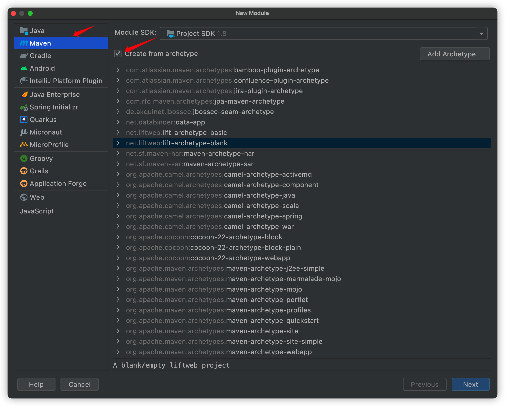
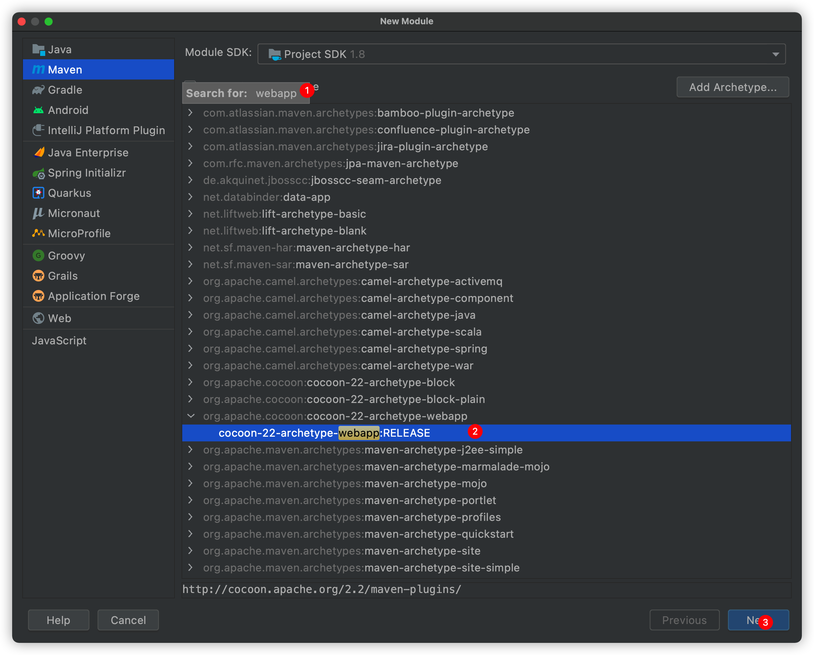

## pom.xml配置

```xml
<?xml version="1.0" encoding="UTF-8"?>
<!-- $Id: pom.xml 642118 2008-03-28 08:04:16Z reinhard $ -->
<project xmlns="http://maven.apache.org/POM/4.0.0" xmlns:xsi="http://www.w3.org/2001/XMLSchema-instance" xsi:schemaLocation="http://maven.apache.org/POM/4.0.0 http://maven.apache.org/maven-v4_0_0.xsd">

  <modelVersion>4.0.0</modelVersion>
  <packaging>war</packaging>

  <name>java02</name>
  <groupId>com.dairsaber</groupId>
  <artifactId>java02</artifactId>
  <version>1.0-SNAPSHOT</version>

  <!--插件配置-->
  <build>
    <plugins>
      <plugin>
        <groupId>org.apache.tomcat.maven</groupId>
        <artifactId>tomcat7-maven-plugin</artifactId>
        <version>2.2</version>
        <configuration>
          <port>80</port>
          <path>/</path>
        </configuration>
      </plugin>
    </plugins>
  </build>

  <dependencies>
    <!--dependency>
      <groupId>com.dairsaber</groupId>
      <artifactId>[the artifact id of the block to be mounted]</artifactId>
      <version>1.0-SNAPSHOT</version>
    </dependency-->
  </dependencies>

</project>

```

## 根据模板生成web项目目录

- 打开IDEA 新建module
- 

- 搜索webapp
- 

- 继续继续继续 确认好名称什么的...