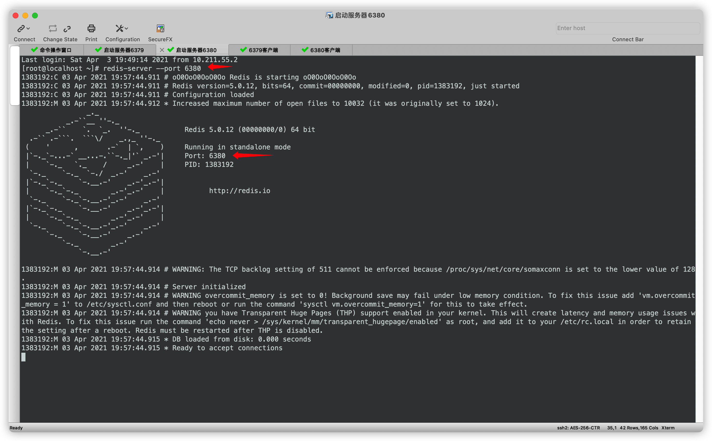

##  Redis服务启动

- 参数启动

  ```shell
  redis-server [--port port]
  ```

  example

  ```shell
  redis-server --port 6379
  ```

- 配置文件启动

  ```shell
  redis-server config_file_name
  ```

  example

  ```shell
  redis-server redis.conf
  ```

  

## Redis 客户端启动

- 启动客户端

  ```shell
  redis-cli [-h host] [-p port]
  ```

  example

  ```shell
  redis-cli -h 61.129.65.248 -p 6384
  ```

##  实例

- 

- 那么当前redis服务只有一个

  

- 在起一个6380端口的redis服务
- 

- 此时的redis服务
- 

- 客户端连接
- 先连接6379的
- 

- 6380的客户端
- 

**注意: 服务器启动指定端口是—port, 客户端启动指定端口是-p . - 的数量不同.**