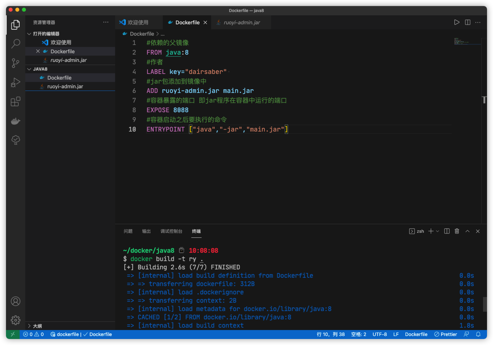

# 这边是运行java8 jar 包的运行环境搭建


## 1. 拉取镜像

```shell
docker pull java:8
```

## 2. 编写 Dockerfile

```dockerfile
#依赖的父镜像
FROM java:8
#作者
MAINTAINER dairsaber
#jar包添加到镜像中
ADD .jar main.jar
#容器暴露的端口 即jar程序在容器中运行的端口
EXPOSE 8088
#容器启动之后要执行的命令
ENTRYPOINT ["java","-jar","main.jar"]
```



## 3.使用当前目录的 Dockerfile 创建镜像，标签为 ry 重点注意后面的点

```shell
docker build -t ry .
```

## 4. TODO