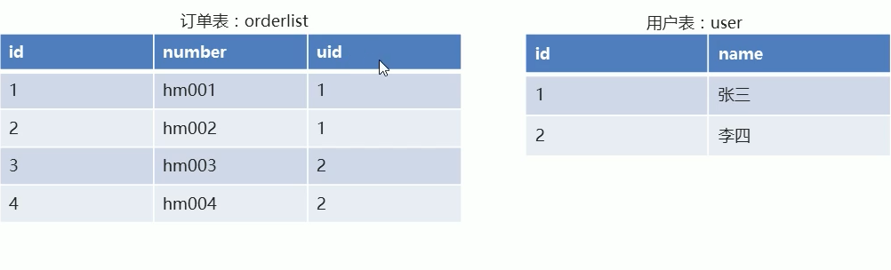

# 约束

## 约束的介绍

- 什么是约束

  对表中的数据进行限定，保证数据的正确性、有效性、完整性。

- 约束的分类

  | 约束                          | 作用         |
  | ----------------------------- | ------------ |
  | PRIMARY KEY                   | 主键约束     |
  | PRIMARY KEY AUTO_INCREMENT    | 主键自增     |
  | UNIQUE                        | 唯一约束     |
  | NOT NULL                      | 非空约束     |
  | FOREIGN KEY                   | 外键约素     |
  | FOREIGN KEY ON UPDATE CASCADE | 外键级联更新 |
  | FOREIGN KEY ON DELETE CASCADE | 外键级联删除 |

  

## 主键约束

### 1. 主键约束的特点

- 主键约束默认包含非空和唯一两个功能；
- 一张表只能有一个主键；
- 主键一般用于表中数据的唯一标识；

### 2. 如何添加主键

- 建表时添加主键约束

```sql
/*
CREATE TABLE 表名(
	列名 数据类型 PRIMARY KEY,
	...
	列名 数据类型 约束
);
*/
```

- 删除主键约束 `ALTER TABLE 表名 DROP PRIMARY KEY;`
- 建表以后单独  添加主键约束 `ALTER TABLE 表名 MODIFY 列名 数据类型 PRIMARY KEY;`

```sql
-- 创建id为主键的学生表 
CREATE TABLE student(
id INT PRIMARY key,
NAME VARCHAR(30),
age INT
);

-- 查询学生表的详细信息 
DESC student;

-- 添加数据 
INSERT INTO student VALUES(null,'张三',34);
# 上条语句会报错 1048 - Column 'id' cannot be null, Time: 0.001000s
INSERT INTO student VALUES(1,'张三',34);

INSERT INTO student VALUES(1,'李四',30);
#上条语句会报错 1062 - Duplicate entry '1' for key 'PRIMARY', Time: 0.002000s
INSERT INTO student VALUES(1,'李四',30);

-- 删除主键 
ALTER TABLE student DROP PRIMARY KEY;

-- 为表添加主键 
ALTER TABLE student MODIFY id INT PRIMARY KEY;

```

### 3. 主键自增约束

-  建表时添加主键自增约束

```sql
/*
	CREATE TABLE 表名(
		列名 数据类型 PRIMARY KEY AUTO_INCREMENT,
		...
		列名 数据类型 约束
	);
*/
```

-  删除主键自增约束 `ALTER TABLE 表名 MODIFY 列名 数据类型;`
- 建表后单独添加主键自增约束 `ALTER TABLE 表名 MODIFY 列名 数据类型 AUTO_INCREMENT;`

<div style="color:red">MySQL 中的自增约束，必须配合键的约束一起使用！ 这边的键不一定是主键。</div>

```sql

-- 删除学生表 
DROP TABLE IF EXISTS student;

-- 创建学生表（编号、姓名、年龄） 编号设为主键自增 
CREATE TABLE student(
	id INT PRIMARY KEY AUTO_INCREMENT,
	NAME VARCHAR(30),
	age INT
);

-- 查询学生表详细 
DESC student;

-- 添加数据 
INSERT INTO student VALUES (1,'张三',18);
INSERT INTO student VALUES (null,'李四',34),(null,'王武',32);

-- 删除自增约束 
ALTER TABLE student MODIFY id INT;
# 注意这边并没有删除主键约束 要删除主键参考上面的主键删除；

-- 建表后单独添加自增约束 
ALTER TABLE student MODIFY id INT AUTO_INCREMENT;

```

### 4. 唯一约束

- 建表时添加唯一约束

```sql
/*
	CREATE TABLE 表名(
		列名 数据类型 UNIQUE,
		...
		列名 数据类型 约束
	);
*/
```

- 删除唯一约束 `ALTER TABLE 表名 DROP INDEX 列名;`
- 创建表之后添加唯一约束 `ALTER TABLE 表名 MODIFY 列名 数据类型 UNIQUE;`

```sql

-- 删除学生表 
DROP TABLE IF EXISTS student;

-- 创建学生表（编号、姓名、年龄） 编号设为主键自增，年龄设置为唯一约束
CREATE TABLE student(
	id INT PRIMARY KEY AUTO_INCREMENT,
	NAME VARCHAR(30),
	age INT UNIQUE
);

-- 查询学生表详细 
DESC student;

-- 添加数据 
INSERT INTO student VALUES (null,'张三',23),(null,'李四',23);
# 上面数据会报错：1062 - Duplicate entry '23' for key 'age', Time: 0.003000s
INSERT INTO student VALUES (null,'张三',23),(null,'李四',24);

-- 删除唯一约束 
ALTER TABLE student DROP INDEX age;

-- 在表创建之后添加唯一约束 
ALTER TABLE student MODIFY age INT UNIQUE;
```

### 5.非空约束

- 建表时添加非空约束

```sql
/*
	CREATE TABLE 表名(
		列名 数据类型 NOT NULL,
		...
		列名 数据类型 约束
	);
*/
```

- 删除非空约束 `ALTER TABLE 表名 MODIFY 列名 数据类型;`
- 建表后单独删除非空约束 `ALTER TABLE 表名 MODIFY 列名 数据类型 NOT NULL;`

```sql
DROP TABLE IF EXISTS student;

-- 创建学生表（编号、姓名、年龄） 编号设为主键自增，姓名设置为非空，年龄设置为唯一
CREATE TABLE student(
	id INT PRIMARY KEY AUTO_INCREMENT,
	NAME VARCHAR(30) NOT NULL,
	age INT UNIQUE
);

-- 查询学生表详细 
DESC student;

-- 添加数据 
INSERT INTO student VALUES (null,null,12);
# 上面语句报错：1048 - Column 'NAME' cannot be null, Time: 0.000000s
INSERT INTO student VALUES (null,'zahngsan',12);

-- 删除非空约束 
ALTER TABLE student MODIFY NAME VARCHAR(30);

-- 添加一条NAME 为空的数据 
INSERT INTO student VALUES (null,null,16);

-- 建表之后单独添加非空约束 
ALTER TABLE student MODIFY NAME VARCHAR(30) NOT NULL;
# 注意这边会有一个错误：1138 - Invalid use of NULL value, Time: 0.009000s
DESC student;# 这边发现并没有修改成功；
# 是因为数据表中有null值,和约束冲突。

-- 将数据中NAME 为null的值更新为''
UPDATE student SET NAME='' WHERE NAME IS NULL;
-- 然后再添加非空约束 
ALTER TABLE student MODIFY NAME VARCHAR(30) NOT NULL;
```

### 6. 外键约束

- 为什么要有外键约束

  当表与表之间的数据有关联性的时候，如果没有相关的数据约束，则无法保证数据的准确性！

  

- 外键的作用：让表与表之间产生关联关系，从而保证数据的准确性！
- 建表时添加外键约束

```sql
/*
	CREATE TABLE 表名(
		列名 数据类型 约束,
		...
		CONSTRAINT 外键名 FOREIGN KEY (本表外键名) REFERENCES 主表名(主表主键列名)
	);
*/
```

- 删除外键 `ALTER TABLE 表名 DROP FOREIGN KEY 外键名;`
- 建表后创建外键 `ALTER TABLE 表名 ADD CONSTRAINT 外键名 FOREIGN KEY(本表外键列名) REFERENCES 主表名(主键列名);`

```sql
-- 创建db2数据库 
CREATE DATABASE db2;
-- 使用db2;
USE db2;
-- 创建user用户表 
CREATE TABLE USER(
id INT PRIMARY KEY AUTO_INCREMENT,
NAME VARCHAR(20) NOT NULL
);
-- 添加用户数据 
INSERT INTO USER VALUES (null,'张三'),(null,'李四');
-- 创建orderlist 订单表 
CREATE TABLE orderlist(
	id INT PRIMARY KEY AUTO_INCREMENT,
	number VARCHAR(20) NOT NULL, 						-- 订单编号
	uid INT,																-- 外键列 
	CONSTRAINT ou_fkl FOREIGN KEY (uid) REFERENCES USER(id)
);
-- 添加数据 
INSERT INTO orderlist VALUES 
(null,'hm001',1),
(null,'hm002',1),
(null,'hm003',2),
(null,'hm004',2);
-- 添加一个订单但是没有真实的用户 
INSERT INTO orderlist VALUES (null,'hm005',3);
# 报错：1452 - Cannot add or update a child row: a foreign key constraint fails (`db2`.`orderlist`, CONSTRAINT `ou_fkl` FOREIGN KEY (`uid`) REFERENCES `USER` (`id`)), Time: 0.001000s

-- 删除李四用户 
DELETE FROM USER WHERE NAME='李四';
# 报错：1451 - Cannot delete or update a parent row: a foreign key constraint fails (`db2`.`orderlist`, CONSTRAINT `ou_fkl` FOREIGN KEY (`uid`) REFERENCES `USER` (`id`)), Time: 0.003000s

-- 删除外键约束 
ALTER TABLE orderlist DROP FOREIGN KEY ou_fkl;

-- 建表后单独添加外键约束 
ALTER TABLE orderlist ADD CONSTRAINT ou_fkl FOREIGN KEY (uid) REFERENCES USER(id);
```
### 7. 外键级联更新和级联删除（实际工作中谨慎使用 牵一发而动全身的操作）

- 什么是级联更新

  当我想把主表中的数据进行修改时，我期望从表中有关联的数据也随之修改

- 添加级联更新

```sql
/*
	ALTER TABLE 表名 ADD
	CONSTRAIN 外键名 FOREIGN KEY (本表外键列名) REFERENCES 主表名(主键列名)
	ON UPDATE CASCADE
*/
```

- 添加级联删除

```sql
/*
	ALTER TABLE 表名 ADD
	CONSTRAIN 外键名 FOREIGN KEY (本表外键列名) REFERENCES 主表名(主键列名)
	ON DELETE CASCADE
*/
```
- 同时添加级联删除和级联更新

```sql
/*
	ALTER TABLE 表名 ADD
	CONSTRAIN 外键名 FOREIGN KEY (本表外键列名) REFERENCES 主表名(主键列名)
	ON DELETE CASCADE ON UPDATE CASCADE
*/
```

- 案例

```sql
-- 接着上面的db2数据库来

USE db2;
SHOW TABLES; # USER orderlist 

--  删除外键约束 
ALTER TABLE orderlist DROP FOREIGN KEY ou_fkl;

-- 添加外键约束 同时添加级联更新和级联删除 
ALTER TABLE orderlist ADD CONSTRAINT ou_fkl FOREIGN KEY (uid) REFERENCES USER(id) ON DELETE CASCADE ON UPDATE CASCADE;

-- 删除id=1的user
DELETE FROM USER WHERE id=1;

-- 验证一下这边有没有级联删除 
SELECT * FROM orderlist; # 成功

-- 更新user id=2 的user 使之id=3；
UPDATE USER set id=3 WHERE id=2;
SELECT * FROM orderlist; # 成功 相应的外键已经更改成3了 

```

