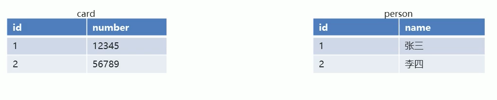
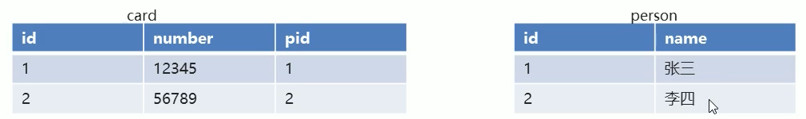
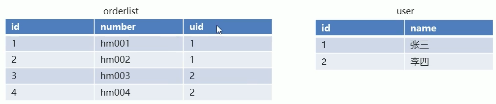
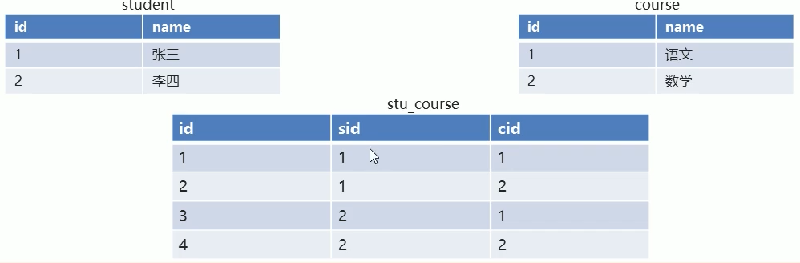

# 多表操作

## 一对一

- 使用场景

  人和身份证. 一个人只有一个身份证, 一个身份证只能对应一个人.

- 建表原则

  在任意一个表建立外键,去关联另外一张表的主键.





```sql
/* 一对一表 */
-- 创建db3数据库
CREATE DATABASE db3;
USE db3;
-- 创建person表 
CREATE TABLE person(
	id INT PRIMARY KEY AUTO_INCREMENT,
	NAME VARCHAR(30)
);

-- 向person表中添加数据 
INSERT INTO person VALUES
(null,'张三'),
(null,'李四');

-- 创建card表
CREATE TABLE card(
	id INT PRIMARY KEY AUTO_INCREMENT,
	number VARCHAR(20) UNIQUE NOT NULL,
	pid INT UNIQUE,
	CONSTRAINT cp_fkl FOREIGN KEY (pid) REFERENCES person(id)
);

-- 添加card的数据 
INSERT INTO card VALUES 
(null,'12345',1),
(null,'23456',2);

DESC card;
```

## 一对多

- 适用场景
  - 用户订单. 一个用户多个订单.
  - 商品分类和商品. 一个分类下面多个商品.

- 建表原则

  在多的一方, 建立外键约束, 来关联另一方的主键



```sql
/* 一对多表 */

-- 创建USER表
CREATE TABLE USER(
	id INT PRIMARY KEY AUTO_INCREMENT,
	NAME VARCHAR(20)
);

-- 添加user数据 
INSERT INTO USER VALUES (NULL,'张三'),(NULL,'李四');

-- 创建orderlist表
CREATE TABLE orderlist(
	id INT PRIMARY KEY AUTO_INCREMENT,
	number VARCHAR(20) UNIQUE NOT NULL,
	uid INT,
	CONSTRAINT ou_fkl FOREIGN KEY (uid) REFERENCES USER(id)
);

-- 添加数据 
INSERT INTO orderlist VALUES 
(NULL,'hm001',1),
(NULL,'hm002',1),
(NULL,'hm003',2),
(NULL,'hm004',2);

# 案例2 分类 和 商品  假设一个分类下多个商品 

-- 创建分类表 
CREATE TABLE category(
	id INT PRIMARY KEY AUTO_INCREMENT,
	NAME VARCHAR(20)
);

-- 添加分类数据 
INSERT INTO category VALUES
(NULL, '手机数码'),
(NULL,'电脑办公');

-- 创建商品表 
CREATE TABLE product(
	id INT PRIMARY KEY AUTO_INCREMENT,
	NAME VARCHAR(30),
	cid INT,
	CONSTRAINT pc_fkl FOREIGN KEY (cid) REFERENCES category(id)
);

-- 添加几条数据 
INSERT INTO product VALUES
(NULL,'小米手机',1),
(NUll,'华为手机',1),
(NUll,'华为电脑',2),
(NUll,'苹果电脑',2);
```


## 多对多

- 适用场景

  学生和课程. 一个学生可以选择多个课程, 一个课程也能被多个学生所选择.

- 建表原则

  需要借助第三张表 `中间表`, 中间表至少包含两个列,分别关联两张表的主键.



```sql

/*多对多*/

-- 创建学生表 
CREATE TABLE student(
	id INT PRIMARY KEY AUTO_INCREMENT,
	NAME VARCHAR(20)
);

-- 添加学生数据 
INSERT INTO student VALUES
(NULL, '张三'),
(NULL,'李四');

-- 创建课程表 
CREATE TABLE course(
 id INT PRIMARY KEY AUTO_INCREMENT,
 NAME VARCHAR(30)
);

-- 添加课程数据 
INSERT INTO course VALUES 
(NULL, '语文'),
(null,'数学');

-- 创建中间表 
CREATE TABLE stu_course(
 id INT PRIMARY KEY AUTO_INCREMENT,
 sid INT,
 cid INT,
 CONSTRAINT sc_fkl1 FOREIGN KEY (sid) REFERENCES student(id),
 CONSTRAINT sc_fkl2 FOREIGN KEY (cid) REFERENCES course(id)
);

-- 添加 一些中间表的数据 
INSERT INTO stu_course VALUES
(NULL,1,1),
(NULL,1,2),
(NULL,2,1),
(NULL,2,2);

```


## 多表查询

- 多表查询的分类
  - 内链接查询
  - 外链接查询
  - 子查询
  - 自连查询
- 准备数据

```sql
/* 多表查询 */

CREATE DATABASE db4;

USE db4;

-- 创建用户表
CREATE TABLE USER(
	id INT PRIMARY KEY AUTO_INCREMENT,
	NAME VARCHAR(20),
	age INT
);
-- 添加数据
INSERT INTO USER VALUES 
(1,'zhangsan',23),
(2,'lisi',24),
(3,'wangwu',25),
(4,'zhaoliu',26);

-- 创建订单表 用户-订单 一对多 
CREATE TABLE orderlist(
	id INT PRIMARY KEY AUTO_INCREMENT,
	number VARCHAR(30),
	uid INT,
	CONSTRAINT ou_fkl FOREIGN KEY (uid) REFERENCES USER(id)
);
-- 添加数据
INSERT INTO orderlist VALUES
(1,'hm001',1),
(2,'hm002',1),
(3,'hm003',2),
(4,'hm004',2),
(5,'hm005',3),
(6,'hm006',3),
(7,'hm007',NULL);

-- 创建分类表
CREATE TABLE category(
	id INT PRIMARY KEY AUTO_INCREMENT,
	NAME VARCHAR(10)
);
-- 添加数据
INSERT INTO category VALUES
(1,'手机数码'),
(2,'电脑办公'),
(3,'烟酒茶糖'),
(4,'鞋靴箱包');

-- 创建商品表 分类-商品 一对多
CREATE TABLE product(
	id INT PRIMARY KEY AUTO_INCREMENT,
	NAME VARCHAR(30),
	cid INT,
	CONSTRAINT pc_fkl FOREIGN KEY (cid) REFERENCES category(id)
);
-- 添加数据
INSERT INTO product VALUES 
(1,'华为手机',1),
(2,'小米手机',1),
(3,'联想电脑',2),
(4,'苹果电脑',2),
(5,'玉溪香烟',3),
(6,'中华香烟',3),
(7,'计生用品',NULL);

-- 添加中间表 用户-产品 多对多
CREATE TABLE user_product(
	id INT PRIMARY KEY AUTO_INCREMENT,
	uid INT,
	pid INT,
	CONSTRAINT up_fkl1 FOREIGN key (uid) REFERENCES USER(id),
	CONSTRAINT up_fkl2 FOREIGN key (pid) REFERENCES product(id)
);
-- 添加数据
INSERT INTO user_product VALUES
(NULL,1,1),
(NULL,1,2),
(NULL,1,3),
(NULL,1,4),
(NULL,1,5),
(NULL,1,6),
(NULL,1,7),
(NULL,2,1),
(NULL,2,2),
(NULL,2,3),
(NULL,2,4),
(NULL,2,5),
(NULL,2,6),
(NULL,2,7),
(NULL,3,1),
(NULL,3,2),
(NULL,3,3),
(NULL,3,4),
(NULL,3,5),
(NULL,3,6),
(NULL,3,7),
(NULL,4,1),
(NULL,4,2),
(NULL,4,3),
(NULL,4,4),
(NULL,4,5),
(NULL,4,6),
(NULL,4,7);
```

## 内连接查询

- 查询原理

  内链接查询的是两张表有交集的部分数据(有主外键关联的数据)

- 查询语法

```sql
-- 显式内连接
SELECT 列名 FROM 表名1 [INNER] JOIN 表名2 ON 条件;

-- 隐式内连接
SELECT 列名 FROM 表名1,表名2 WHERE 条件;
```

- 案例

```sql
-- 查询用户和对应订单信息 
# 显式内连接 
SELECT * FROM USER INNER JOIN orderlist ON orderlist.uid = USER.id;

-- 查询用户和对应订单信息, 起别名 
SELECT * FROM USER u INNER JOIN orderlist o ON u.id = o.uid;

-- 查询用户姓名,年龄, 和订单编号.
SELECT
		u.name,
		u.age,
		o.number
FROM 
		USER u 
INNER JOIN
		orderlist o 
ON
		u.id=o.uid;


# 隐式内连接
SELECT
		u.name,
		u.age,
		o.number
FROM 
		USER u,
		orderlist o 
WHERE
		u.id=o.uid;
```


## 外连接查询

- 左外连接

  - 查询原理

    查询左表的全部数据,和左右两张表有交集部分的数据.

  - 查询语法: `SELECT 列名 FROM 表名1 LEFT [OUTER] JOIN 表名2 ON 条件;`

- 右外连接

  - 查询原理

    查询右表的全部数据,和左右两张表有交集部分的数据.

  - 查询语法: `SELECT 列名 FROM 表名1 RIGHT [OUTER] JOIN 表名2 ON 条件;`

```sql
/*外连接查询*/

-- 左外连接 
-- 查询所有的用户信息,以及对应的订单信息 
SELECT
		u.*,
		o.number
FROM
		USER u 
LEFT JOIN
		orderlist o 
ON
		u.id=o.uid;
		
-- 右外连接		
-- 查询所有订单信息,以及订单所属的用户信息 
SELECT
		o.*,
		u.NAME
FROM 
		USER u 
RIGHT JOIN
		orderlist o 
ON
		u.id=o.uid;
```

## 子查询

- 概念

  查询语句中嵌套了查询语句, 我们就将嵌套的查询称为子查询

- 应用场景

- 结果式单行单列的(也就是只有一条数据的)

  - 可以将查询的结果作为另一条语句的查询条件, 使用运算符判断. `=>` ` >` `=`  `<`  `<=`等.

  - 查询语法

    `SELECT 列名 FROM 表名 WHERE 列名=(SELECT 列名 FROM 表名 [WHERE 条件]); `

```sql
-- 查询年龄最高的用户姓名 
SELECT MAX(age) FROM USER;
-- 如果我们想把名称也显示出来 
SELECT NAME,MAX(age) FROM USER;
# 这边会报错:1140 - In aggregated query without GROUP BY, expression #1 of SELECT list contains nonaggregated column 'db4.USER.NAME'; this is incompatible with sql_mode=only_full_group_by, Time: 0.000000s
SELECT NAME,age FROM USER WHERE age=(SELECT MAX(age) FROM USER);
```

- 结果是多行单列的

  - 可作为条件,使用运算符IN或者NOT IN 进行判断.

  - 查询语法

    `SELECT 列名 FROM 表名 WHERE 列名 [NOT] IN (SELECT 列名 FROM 表名 [WHERE 条件]);`

```sql
-- 查询张三和李四的订单信息 
SELECT * FROM orderlist WHERE uid IN (1,2);
SELECT id FROM USER WHERE NAME IN ('zhangsan','lisi');

SELECT * FROM orderlist WHERE uid IN (SELECT id FROM USER WHERE NAME IN ('zhangsan','lisi'));
```
- 结果是多行多列的

  - 查询结果可以作为一张虚拟表参与查询

  - 查询语法

    `SELECT 列名 FROM 表名 [别名],(SELECT 列名 FROM 表名 [WHERE 条件]) [别名] [WHERE 条件]);`

```sql
-- 查询订单表中id大于4的订单信息和所属用户信息
SELECT
		u.NAME,
		o.number
FROM 
		(SELECT * FROM orderlist WHERE id>4) as o,
		USER as u
WHERE
		o.uid=u.id;
```

## 自关联查询

- 概念

  在同一张表中数据具有关联性,我们可以把这张表当成多个表来查询

```sql
		 
/*自联查询*/

-- 创建员工表 
CREATE TABLE employee(
	id INT PRIMARY KEY AUTO_INCREMENT,
	NAME VARCHAR(20),
	mgr INT,																-- 上级编号 
	salary DOUBLE
);
-- 添加数据 
INSERT INTO employee VALUES
(1001,'孙悟空',1005,9000.00),
(1002,'猪八戒',1005,8500.00),
(1003,'沙和尚',1005,7900.00),
(1004,'小白龙',1005,8500.00),
(1005,'唐僧',NULL,15000.00),
(1006,'武松',1009,7600.00),
(1007,'李逵',1009,7400.00),
(1008,'林冲',1009,8100.00),
(1009,'松江',NULL,16000.00);

-- 查询所有员工的姓名以及直接上级的姓名,没有上记得员工也要查询;
SELECT 
	e1.*,
	e2.name as manager
FROM 
	employee as e1
LEFT JOIN
	employee as e2
ON
	e1.mgr=e2.id;
```


## 练习

```sql

/*练习*/
-- 1. 查询用户的编号,姓名,年龄.订单编号 
SELECT 
	u.*,
	o.number 
FROM
	USER u,
	orderlist o 
WHERE
	u.id = o.uid;

-- 2. 查询所有用户.用户的编号,姓名年龄.订单编号.
SELECT 
	u.*,
	o.number
FROM
	USER u
LEFT JOIN
	orderlist o 
ON
	u.id = o.uid;

-- 3. 查询所有订单. 用户的编号,姓名,年龄. 订单编号.
SELECT 
	u.*,
	o.number
FROM
	USER u 
RIGHT JOIN
	orderlist o 
ON
	u.id = o.uid;
	
-- 4. 查询用户年龄大于23岁的信息. 显示用户的编号,姓名,年龄. 订单编号.
SELECT
	u.*,
	o.number
FROM
	(SELECT * FROM USER WHERE age > 23) u,
	orderlist o 
WHERE
	u.id = o.uid;
	
# or 

SELECT
	u.*,
	o.number
FROM
	USER u,
	orderlist o 
WHERE
	u.id = o.uid
	AND
	u.age >23;


-- 5. 查询张三和李四用户的信息. 显示用户编号,姓名,年龄. 订单编号.
SELECT
	u.*,
	o.number
FROM
	(SELECT * FROM USER WHERE NAME IN ('zhangsan','lisi')) u,
	orderlist o 
WHERE
	u.id = o.uid;

# or 

SELECT
	u.*,
	o.number
FROM
	USER u,
	orderlist o 
WHERE
	u.id = o.uid
	AND
	u.NAME IN ('zhangsan','lisi');
	
-- 6. 查询商品分类的编号,分类的名称.分类下的商品名称
SELECT
	c.id,
	c.NAME category,
	p.NAME
FROM
	category c,
	product p 
WHERE
	p.cid = c.id;
	
-- 7. 查询所有商品分类.商品分类的编号, 分类的名称.分类下的商品名称.
select 
	c.id,
	c.NAME category,
	p.NAME
FROM
	category c 
LEFT JOIN
	product p 
ON
	c.id = p.cid;
	
-- 8. 查询所有商品信息.商品分类的编号, 分类的名称.分类下的商品名称.
SELECT
	c.id,
	c.NAME as category,
	p.NAME
FROM
	category c 
RIGHT JOIN
	product p 
ON
	p.cid = c.id;

-- 9. 查询所有用户和该用户能查看的所有商品.显示用户编号,姓名,年龄.商品名称.
SELECT
	u.id,
	u.NAME,
	u.age,
	p.NAME product 
FROM 
	USER u 
LEFT JOIN
	(SELECT up.uid,product.* FROM user_product up,product WHERE up.pid = product.id) p
ON
	p.uid = u.id;
# 这条语句会查出所有包括没有商品的用户
# or 
#下面则只会查询交集 
SELECT 
	u.id,
	u.NAME,
	u.age,
	p.NAME product 
FROM 
	USER u,
	product p,
	user_product up
WHERE
	up.uid = u.id 
	AND
	up.pid = p.id;

-- 10. 查询张三和李四 用户和该用户能查看的所有商品.显示用户编号,姓名,年龄.商品名
SELECT
	u.id,
	u.NAME,
	u.age,
	p.NAME product
FROM
	USER u,
	product p,
	user_product up 
WHERE
	up.uid = u.id 
	AND
	up.pid = p.id
	AND
	u.NAME IN ('zhangsan','lisi');
```

