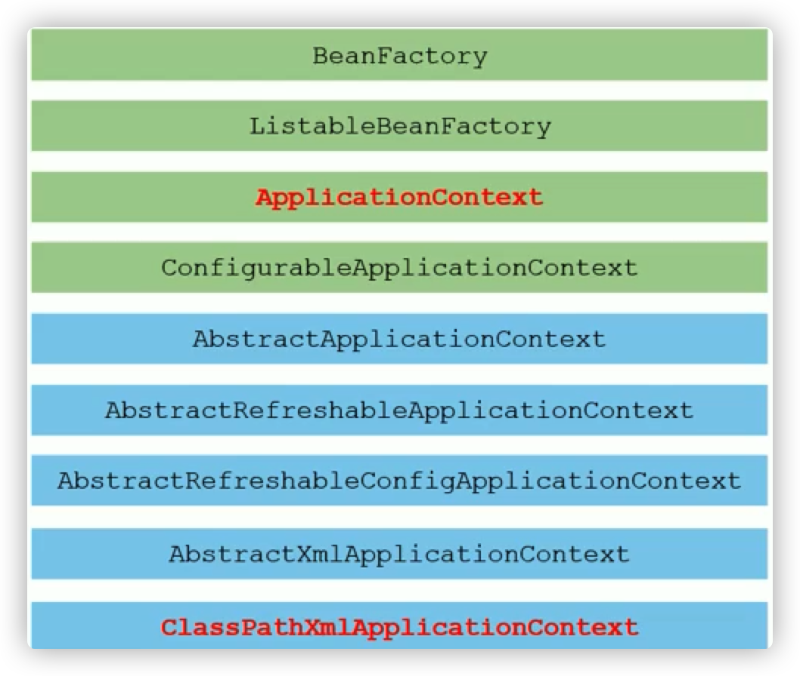

这边给一些概念想了解的自己去search and research

## IoC核心接口

 

## 组件扫描过滤器

- 名称: @ComponentScan

- 类型: 类注解

- 位置: 类定义上方

- 作用: 设置Spring配置加载类扫描规则

- 范例

  ```java
  @ComponentScan(
  	value="com.dairsaber",
    excludeFilters=
    	@ComponentScan.Filter(
      	type= FilterType.ANNOTATION,
        classes=Repository.class
      )
  )
  public class SpingConfig {}
  ```

- includeFilters: 设置包含性过滤器

- excludeFilters: 设置排除性过滤器

- type: 设置过滤器类型

## 自定义组件过滤器

- 名称: TypeFilter

- 类型: 接口

- 作用: 自定义类型过滤器

- 范例

  ```java
  public class MyTypeFilter implements TypeFilter {
    public boolean match(MetadataReader mr, MetadataReaderFactory mrf) throws IOException {
      ClassMetadata cm = metadataReader.getClassMetadata();
      String className = cm.getClassName();
      if(className.equals("com.dairsaber.dao.impl.AccountDaoImpl")){
        return false;
      }
      return true;
    }
  }
  ```

## 自定义导入器

- bean 只有通过配置才可以进入spring容器, 被spring加载并控制
- 配置bean的方式如下
  - XML文件中使用<bean/>标签配置
  - 使用@Component及衍生注解配置
- 在企业开发中, 通常需要配置大量的bean, 需要一种快速高效配置大量bean的方式

实现:

- 名称: ImportSelector

- 类型: 接口

- 作用: 自定义bean导入器

- 范例

  ```java
  public class MyImportSelector implements ImportSelector {
    public String[] selectImports(AnnotationMetadata icm) {
    	return new String[] {
        "com.dairsaber.dao.impl.AccountDaoImpl"
      }
    }
  }
  ```

  ```java
  @Configuration
  @ComponentScan("com.dairsaber")
  @Import(MyImportSelector.class)
  public class SpringConfig {}
  ```

## 自定义注册器

- 名称: ImportBeanDefinitionRegistrar

- 类型: 接口

- 作用: 自定义bean定义注册器

- 范例:

  ```java
  public class MyImportBeanDefinitionRegistrar implements ImportBeanDefinitionRegistrar {
    public void registerBeanDefinitions(AnnotationMetadata icm, BeanDefinitionRegistry r){
      ClassPathBeanDefinitionScanner scanner = new ClassPathBeanDefinitionScanner(r, false);
      // 使用了一个内部类
      TypeFilter tf = new TypeFilter() {
      	public boolean match(MetadataReader mr, MetadataReaderFactory mrf) throws IOException {
     		 	return true;
    		}
      }
      scanner.addIncludeFilter(tf);
      // scanner.addExcludeFilter(tf);
      scanner.scan("com.dairsaber");
    }
  }
  ```

## bean初始化过程解析

- BeanFactoryPostProcessor
  - 作用:定义了在bean工厂对象创建后, bean对象创建前执行的动作, 用于对工厂进行创建后业务处理
  - 运行时机: 当前操作作用于对工厂进行处理, 仅运行一次
- BeanPostProcessor
  - 作用: 定义了所有bean初始化前后进行的统一动作, 用于对bean进行创建前业务处理与创建后业务处理
  - 运行时机:  当前操作伴随着每个bean的创建过程, 每次创建bean均运行该操作
- InitializingBean
  - 作用: 定义了每个bean的初始化钱进行的动作, 属于非统一性动作,  用于对bean 进行创建前业务处理
  - 运行时机: 当前操作伴随着任意一个bean的创建过程, 保障其个性化业务处理
- 注意: 上述操作均需要被spring容器加载方可运行.

## 繁琐的bean初始化过程处理

- FactoryBean
  - 对单一的bean的初始化过程进行封装,达到精简配置的目的.
- FactoryBean 和 BeanFactory的区别
  - FactoryBean: 封装单个bean的创建过程
  - BeanFactory: Spring容器顶层接口, 定义了bean的相关获取操作

