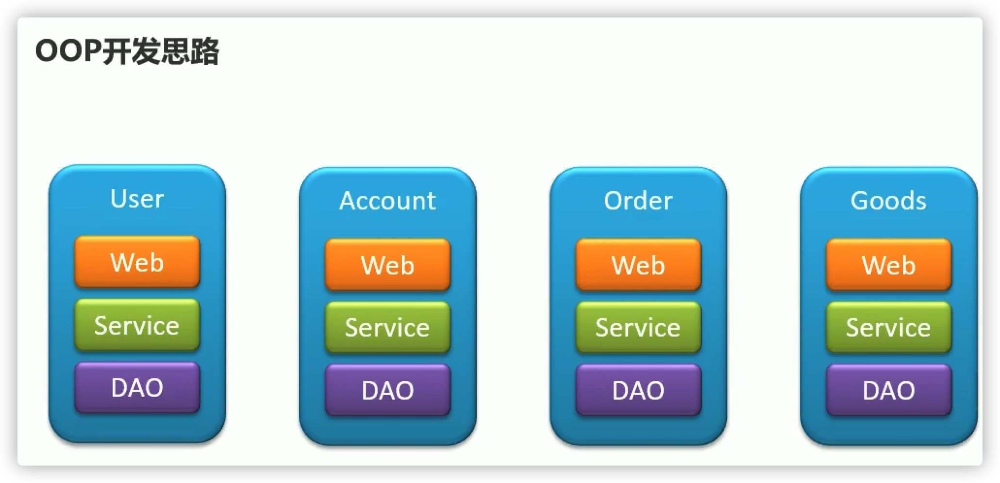
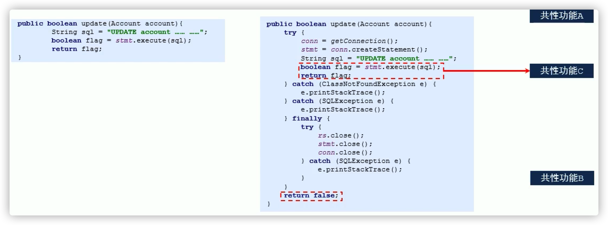

# AOP 简介

## oop的开发思路

## Aop的开发思路

- AOP(Aspect Oriented Programing) 面向切面编程, 一种编程范式, 隶属于软工范畴, 指导开发者如何组织程序结构 (他是一个思想)
- AOP弥补了OOP的不足, 基于OOP基础之上进行横向开发
  - OOP规定程序开发以类为主体模型,一切围绕对象进行,完成某个任务先构建模型
  - AOP程序开发主要关注基于OOP开发中的共性功能, 一切围绕共性功能进行,  完成某个任务先构建可能遇到的所有共性功能(当所有功能都开发出来也就没有共性与非共性之分)
- AOP联盟

## AOP 作用

- 伴随着AOP时代的降临, 可以从各个行业标准化, 规范化开始入手, 一步一步将所有共性功能逐一开发完毕, 最终以功能组合的方式来完成个别业务模块乃至整体业务系统的开发
- 目标: 将软件开发由手工制作走向半自动化阶段, 实现“插拔式组件体系结构” 搭建

## AOP优势

- 提高代码可重用性
- 业务代码编码更简洁
- 业务代码维护更高效
- 业务功能扩展更便捷

# AOP入门案例

## AOP相关概念

